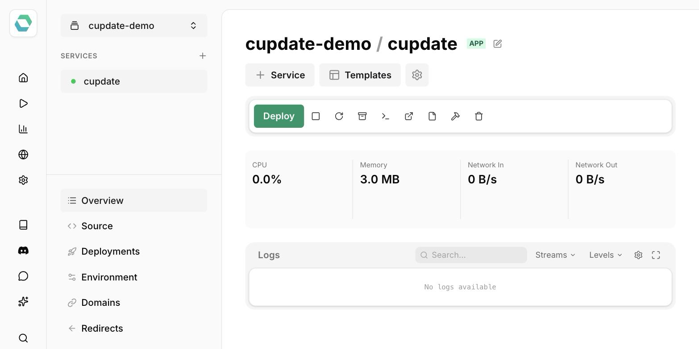

# Running Cupdate on Easypanel

[Easypanel](https://easypanel.io) is a self-hosted Docker deployment platform. It has a one-click Easypanel template for Cupdate, which runs the image above with the Docker socket bound read-write and a persistent volume for `/var/run/data`.

